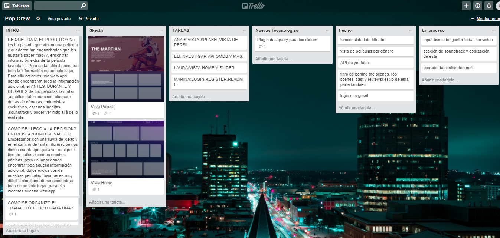
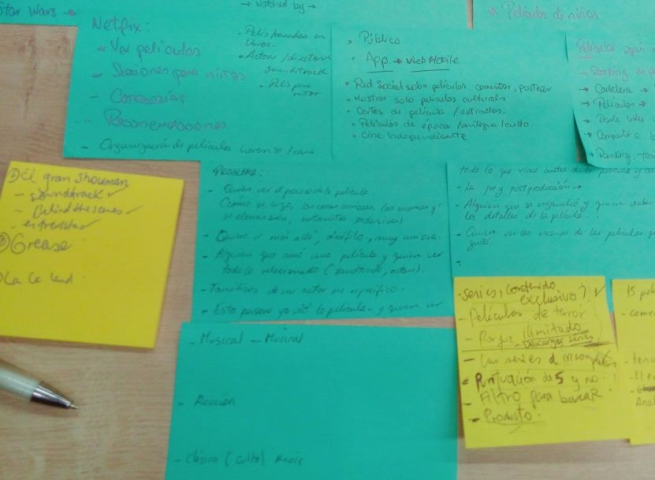
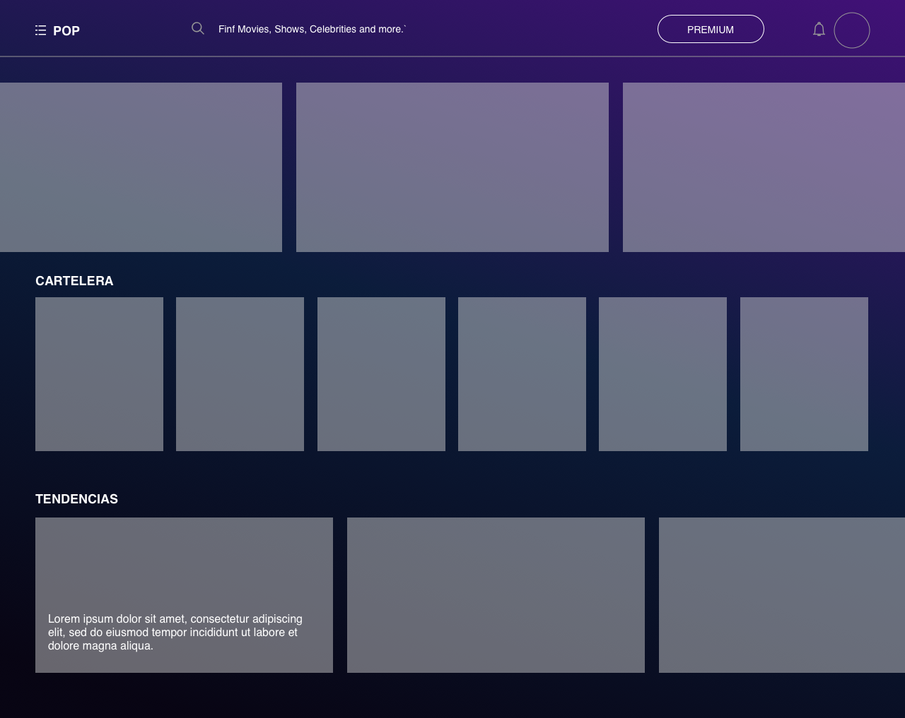
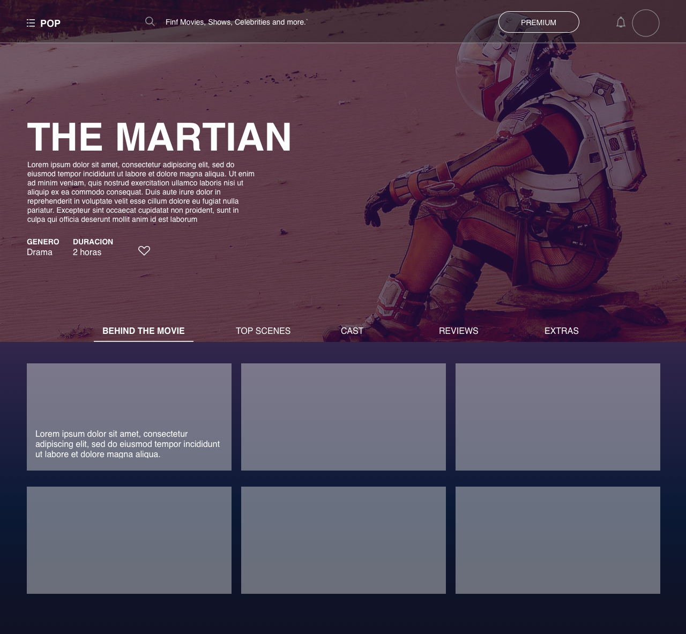

# HACKATON - CINEFILIA
Cinefilia es un website donde encontrarás Behind the scenes, cast, reviews y soundtracks de todas las películas.

## Desarrollado para
[Laboratoria](http://laboratoria.la)

### INTRODUCCIÓN
>* ¿No te ha pasado que te enganchas tanto con una película y quieres saber todo acerca de ella?, pues llegó Cinefilia.

> * Cinefilia nace con la idea de brindar información adicional de las mejores películas, generar contenido exclusivo acerca de la pre-producción / producción / post-producción.

>* Todo esto en un solo lugar al alcance de  aquellos Cinéfilos y público interesado por el cine.
## ETAPAS DE DESARROLLO
### PLANIFICACIÓN
>Implementamos una lista de tareas es Trello para agendar los pasos que estamos dando, tener agendado lo que tenemos hecho y lo que falta por hacer y así regular nuestro tiempo.

> También algo que funcionó desde esta etapa fueron los minutos empleados para el Dayly y tener pequeñas retrospectivas en un intervalo de 2 horas.

### BRAINSTORMING

>*	El primer dia iniciamos eligiendo el problema que nos gustaria resolver con la temática de películas.

>* Empezamos con una lluvia de ideas y en el camino de tanta información nos dimos cuenta que para ver cualquier tipo de película existen  muchas páginas, pero un lugar donde encontrar toda aquella información adicional,  datos exclusivos de nuestras películas favoritas es muy difícil o simplemente no encuentras todo en un solo lugar.

>* Para ello empezamos a crear una web donde encontrarán toda la información adicional, el ANTES, DURANTE Y DESPUÉS de tus películas favoritas ,aquellos datos curiosos, bloopers, detrás de cámaras, entrevistas exclusivas, escenas inéditas ,soundtracks ,en resumen ver más allá de lo evidente.

### RESEARCH
>En este proceso comenzaron las entrevistas vía redes sociales a nuestro público objeto, cinéfilos, uniendo y analizando sus respuestas fuimos teniendo una idea más amplia acerca de todo aspecto de nuestra web.

### SKETCH
>* Una vez selecionado el tema , nos enfocamos en el diseño. Para el sketching queríamos un vista que llame la atención al usuario, y encierre nuestros objetivos, elegimos colores de acuerdo a lo que queremos mostrar, creatividad, imaginación para lllegar al éxito.

>*  Lo siguiente a realizar fue delegar funciones a cada miembro para el maquetado con html , css, funcionalidad otros.

>*  El objetivo a lograr es tener la página con la funcionalidad al 100% ,obtener una data con toda la información de los videos que queremos mostrar y mostrarlo en la página.

## RECURSOS A UTILIZAR:

- `HTML5`
- `Jquery`
- `CSS3`
- `bootstrap`
- `FireBase`
- `API The Movie Database`
- `Trello` https://trello.com/b/gtrTawgq/pop4

##  SQUAD
* Elizabet Alcalá
* Anais Olivares
* Laura Galindo
* Marina Rodriguez
